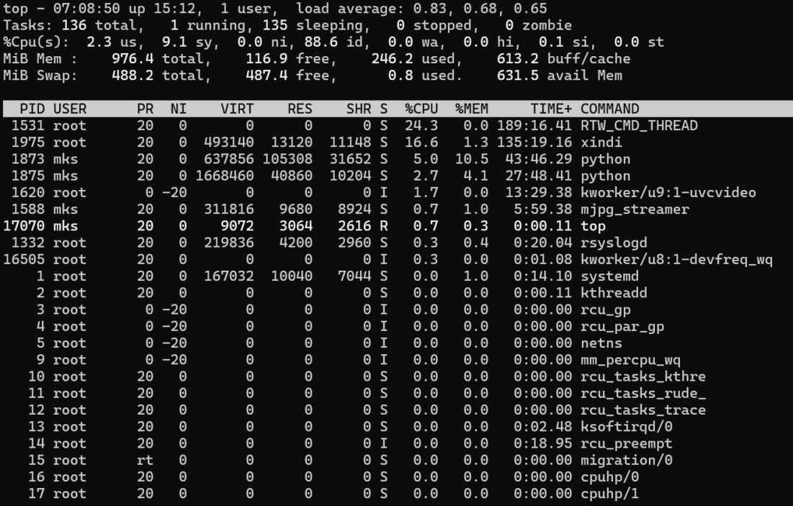
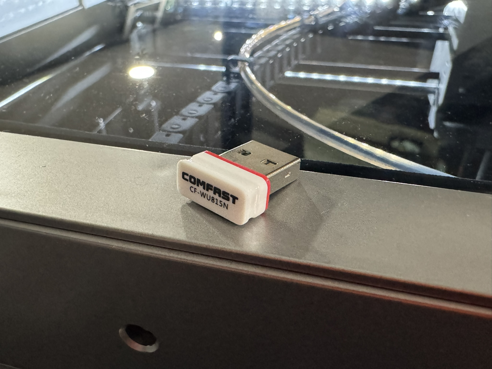

# Disabling Wifi 8188gu module
As of QIDI's latest Plus4 firmware release, 1.6, the USB wireless module included 
in current machines is using an rtlink dongle that is creating a kernel thread that
is consuming considerably more CPU cycles than is expected. Due to the finite 
compute available on the SOC, it's best to preserve it for klipper. 

This can be achieved in by simply removing the dongle from the Plus4 system board or
more dramatically disabling the driver module from loading when the printer is
booting up. 

## Confirm The Issue
The easiest way to observe impact is running the `top` or `htop` commands from
the command line. If you see `RTW_CMD_THREAD` and CPU is high, you are impacted. In this screenshot, the user's printer is consuming a considerable amount of CPU at 24.3%

## Option 1: Unplug the module from the board
Remove the system fan board cover and examine the USB ports on the side right side of
the board. The USB dongle looks like this, but could vary:

Once removed, you need to restart your printer so the module isn't loaded. Until the
machine is restarted, the module will remain loaded and continue to needlessly consume
CPU cycles.

## Option 2: Blacklist the Driver Module
If you'd rather NOT remove the dongle, you can simply blacklist the module from loading
in the first place. To do so, execute this simple one liner to create the this file:

`sudo bash -c "echo 'blacklist 8188*' > /etc/modprobe.d/blacklist-8188gu.conf"`

Once complete, restart your Plus4.

## Validate The Fix
Once you have restarted your Plus4, connect via `ssh` to your printer and run the following command:

`ps aux|grep -i rtw_cmd_thread && echo 'Module still loaded' || echo 'Module not loaded'`

