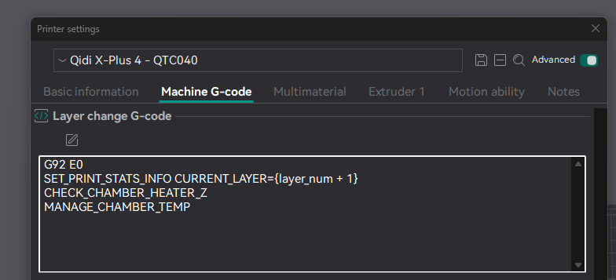

# A Dynamic Chamber Temperature Manager

If we follow [the guide outlined here](../chamber-heater-investigation#dont-bore-me-with-the-details-just-tell-me-what-to-do) to achieve
a more accurate reading on the Plus4's actual chamber temperatures when the chamber heater is enabled, it can be observed that the
heat from the print bed alone is enough to raise the air temperatures inside to the Plus4 to very high levels.

This issue is actually worse if that configuration change is not made, just that the user won't be informed of the dangerous temperatures.
Without the config change though, if the user watches the `GD32` temperatures, which is the temperature of the air inside the rear of the
print head, this does give a fairly good indication of the true chamber air temperature, which will typically be 2-3C less than what `GD32` reports.

Now, without adequate management the true chamber temperatures can actually reach high enough to damage the camera and reduce the lifespan of other
components located within the main print chamber.

This is all due to the fairly excellent insulation of the Plus4 that comes installed with as stock, which allows chamber temperatures to
climb to over 85C in certain scenarios, according to reports by various users on the Official Qidi Discord Channel.

##  How to fix this?

The Qidi Plus4 comes with an exhaust fan, which Qidi also sometimes refers to as the chamber circulation fan.
This fan pulls air from the main print chamber through the activated carbon filter and exhausts it out the circular vent located on the printer's rear panel.
This then allows for fresh cooler air to be drawn into the chamber through the various cracks in the door, the upper lid, and various other pathways into
the main print chamber (such as via the holes between the mainboard chamber and the print chamber that the cables pass though).

The idea is to dynamically control the exhaust fan speed to better manage the chamber temperatures when they are above the chamber temperature target.

## A chamber temperature manager implemented in Gcode

The following gcode implements a fairly basic chamber temperature management functionality as a Gcode macro which is ideally called upon every layer change.

It has the following functionality
- If the chamber temperature is above 70C, then the exhaust fan is turned on to 100% speed
- If the chamber temperature is less than the chamber target temperature, then the exhaust fan is turned off
- If the chamber temperature is greater than 3C above the targetted chamber temperature, then the exhaust fan speed is ramped proportionally to the amount above the target + 3C.

An example of the exhaust fan ramping behavior is as follows:

- If the chamber temperature is more than 8C above the target, then the exhaust fan is set to 100%
- If the chamber temperature is 4C above the target, the exhaust fan is at 20%.  At 5C above, the fan is set 40%, and so on.


To add the chamber management functionality, add following macro to the end of your `gcode_macro.cfg` file

```
[gcode_macro MANAGE_CHAMBER_TEMP]
gcode:
    
    
    
        M106 P3 S255                      # Too hot! Set the exhaust fan to 100%
    
        # Allow for 3C of "grace" before we start ramping the exhaust fan speed
        # This prevents the macro from fighting with the chamber heater PID algorithm
        
        
            M106 P3 S0                    # Disable Exhaust Fan
        
            
            M106 P3 S{speed}
        
    
```

Now make sure that this macro gets called on each layer change by adding it to the layer change machine g-code section in the Printer defition in your slicer.

As an example for Orca Slicer:



Prusa Slicer, Qidi Slicer, Qidi Studio, and others all have a similar machine code definition section within the Printer Settings.

## An Added Bonus

Generally speaking, with the above management Gcode is place, it's possible to print PLA/PETG with the door closed without issues.
The lid should still be removed, or at the very least propped open, when printing with PLA/PETG.

