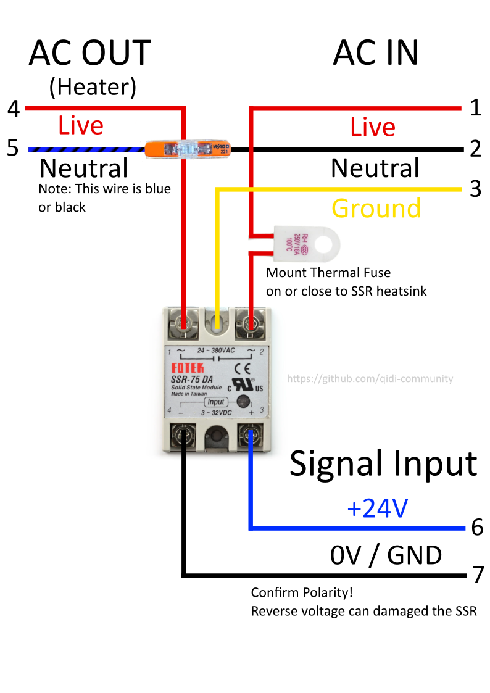
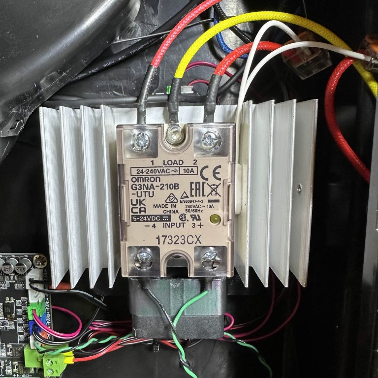

# Qidi Plus 4 SSR Upgrade

⚠️ **This mod requires you to work with AC mains wiring. A mistake in your work can cause harm to you and/or those around you. Please understand and only do this if you are confident in what you are doing. We accept no liability for damage or harm to you, others or your property. If you are in doubt, do not perform this mod.** ⚠️ 

The Qidi Plus 4 contains an SSR (solid state relay) board that controls the mains AC power to the chamber heater. On early units of the printer this board was melting on 120V. Qidi's solution was to reduce the maximum duty cycle for the heater in Klipper firmware. The issue is explained in-depth [here.](https://github.com/qidi-community/Plus4-Wiki/tree/main/content/ssr-board)

This is not ideal for a few reasons:

- Software should not be the sole factor preventing a component from overheating and damaging the printer. 
- The chamber heater now has a reduced amount of effective wattage and heats up significantly slower. [However this has been optimized as much as possible.](https://github.com/qidi-community/Plus4-Wiki/tree/main/content/tuning-for-40-percent-heater-power)

Qidi has since designed a new SSR board which appears to perform adequately. And this SSR mod should no longer be needed to have a safe printer. However there are still benefits to performing this mod.

- Upgrade to a high quality SSR
- Thermal protection if the SSR fails
- Ability to run the chamber heater at a higher max power setting.


### Parts Required

- A puck style SSR (see our recommendations below)
- Heatsink for SSR (optional, but recommended)
- Wago or other connectors rated for AC
- Thermal Fuse 80 - 100C

### Replacement SSR

This mod replaces Qidi's SSR board with a "hockey puck" style DIN mounted SSR. We believe only the highest quality SSR modules should be used and recommend you buy one of the following: 

- OMRON G3NA-210B
- Panasonic AQA211VL 15A
- Fotek SSR-10DA ❗Be careful of clones that look similar. Real Fotek SSRs are made in Taiwan, not China, and are not called F**Q**TEK. [See this article](https://protosupplies.com/inferior-counterfeit-fotek-ssr-25-solid-state-relays-on-the-market/) for more details. 

They were chosen based on the following criteria:

- Well known and reliable brand
- Ability to handle 10 amps or higher continuously
- Zero-crossing Switching
- Contain a snubber circuit to prevent EMI pollution on the AC grid
- (Optional) Contain over temp protection. 

### SSR Heatsink

sarge013 on Discord has done excellent work documenting the thermal performance of the replacement SSRs listed above vs the stock SSR board. We suggest taking a look at [his Google Drive](https://drive.google.com/drive/folders/18jHYNrEYjhrYad5NhcfUCJCpBB3ILfZh). 

In summary all of the SSRs suggested above operate at acceptable temperatures. A heatsink is not strictly required, but an excellent idea. 

Heatsinks for the SSR should ideally be bare metal in order to make grounding the SSR easier. Not painted or anodized. Community members have used the following with success:

[80 x 50 x 50mm Heatsink (Amazon US)](https://www.amazon.com/Easycargo-Aluminum-Heatsink-80x50x50mm-80mmx50mmx50mm/dp/B07B3Y2ZNY?th=1)

[126 x 70 x 50mm Heatsink (Amazon US)](https://www.amazon.com/dp/B07QJ8DV8G)


### Install

⚠️This is where the AC mains wiring starts. Do not proceed if you are in doubt of what you are doing. Your safety is your responsibly ⚠️


- Print [this mount](https://www.printables.com/model/1052218-qidi-plus-4-ssr-board-mount) or [this mount](https://www.printables.com/model/1057104-qidi-plus-4-modular-ssr-mounting-bracket/files) for the SSR 

- Follow [this video](https://drive.google.com/drive/folders/180hEn-bLIeLqfGz-xd5-HUZBBD4ypZ1-) for opening the printer and accessing the SSR.

- Make note of the wiring on Qidi's SSR board. There are 7 wires.


- Remove Qidi's SSR board and Install the printed mount with the new SSR.

- Connect the wires as follows.
  - Mount the thermal fuse as close to possible to the SSR.
  - The ground wire must have continuity with the heatsink on the SSR. The Fotek you can just screw the eyelet terminal to the front of the SSR. On the Panasonic and Omron you need to attach the ground wire to the heatsink. Or on the back between the SSR and the heatsink. Check with a multimeter. Grounding the SSR is critical to preventing EMI.



- Perform A final check before powering on.


(credit: theFPVgeek)

- With the rear panel still removed, power on the printer.  

- Start the chamber heater and check that it is heater and the new SSR installation is performing correctly. The SSR's LED should be blinking at the same rate as the LED On the mainboard.


### Flickering Lights

If you encounter flickering lights after installing the new SSR, then you need to adjust the PWM frequency in Klipper. This is a known issue and the Voron team has [a good explanation of how to fix it.](https://docs.vorondesign.com/community/troubleshooting/cat40/lights_flickering.html)


**jetmech43** from the Qidi Discord server had conducted some fine tuning for his aftermarket SSR install, and arrived at the following values to both prevent light flicking when on 60Hz/120VAC power, as well as a refined set of PID paramaters

Find the following field values within the `[heater_generic chamber]` chamber section within `printer.cfg` and set them to the following values (leave the rest of the fields intact)

```
[heater_generic chamber]
pwm_cycle_time:0.02088            # Reduced to 0.02088 seconds to reduce flicker (within 0.3 limit)
control = pid
pid_Kp=45
pid_Ki=0.1
pid_Kd=5000
```


