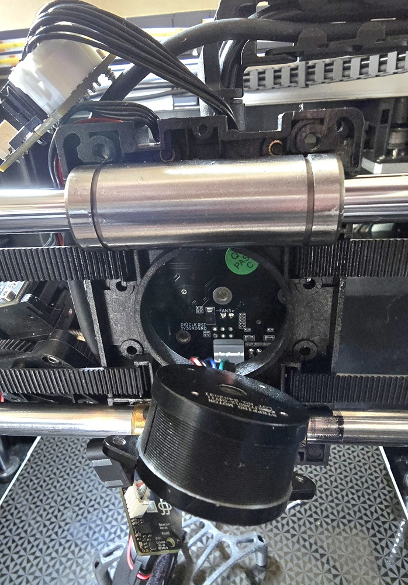
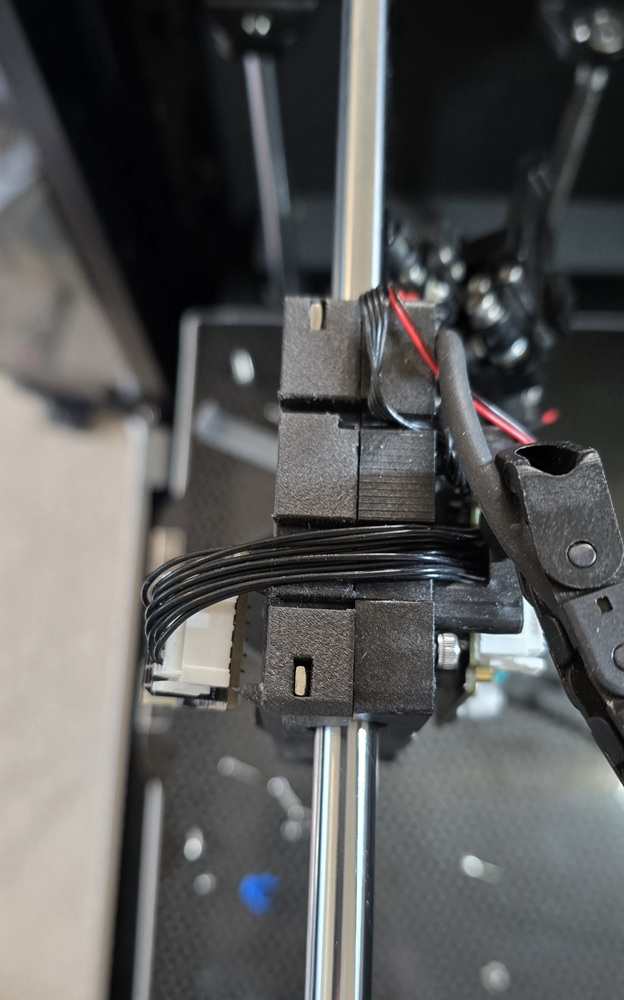
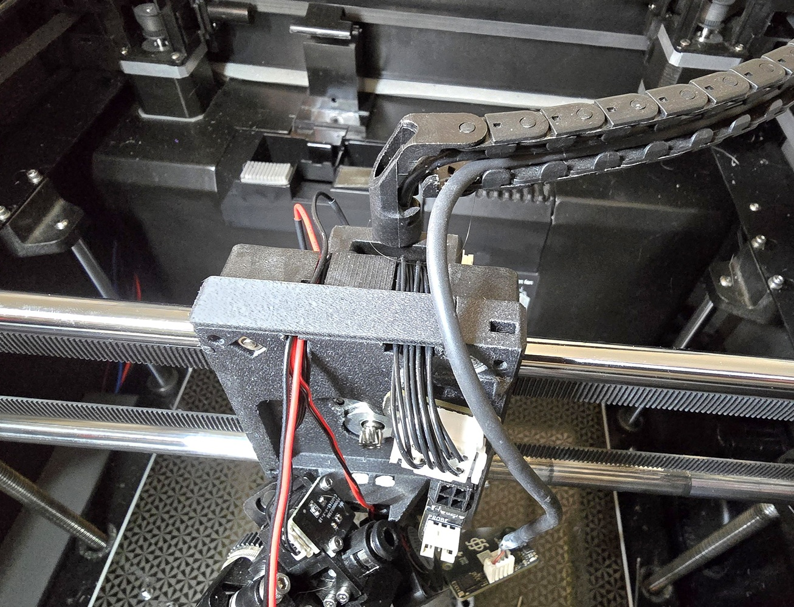
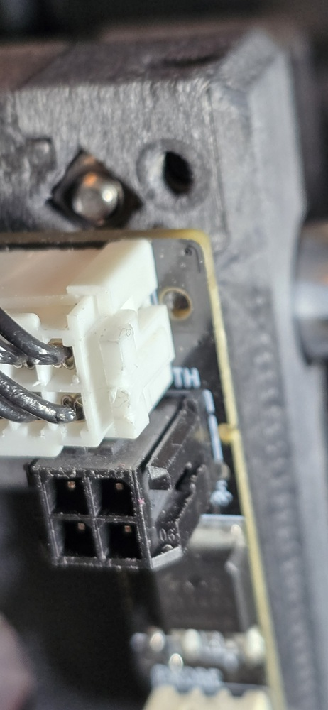
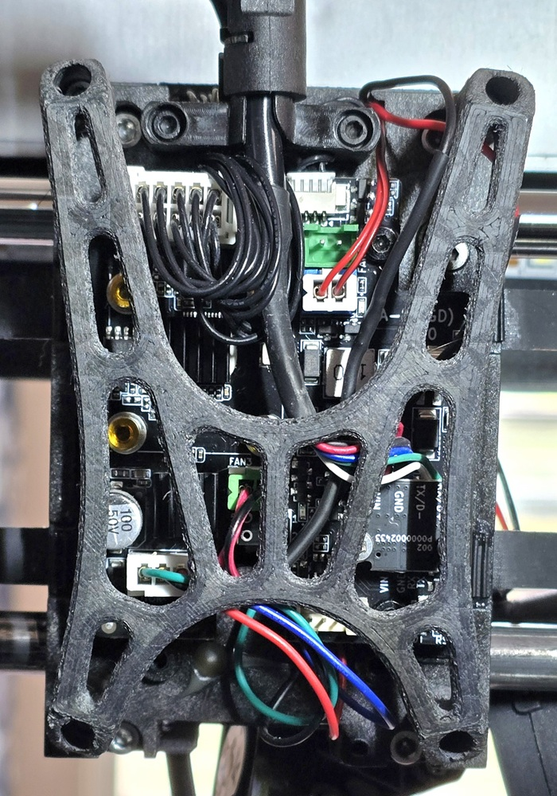
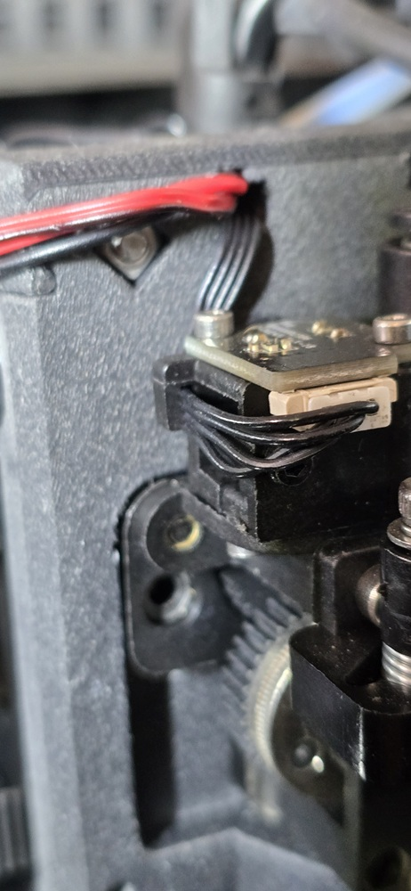
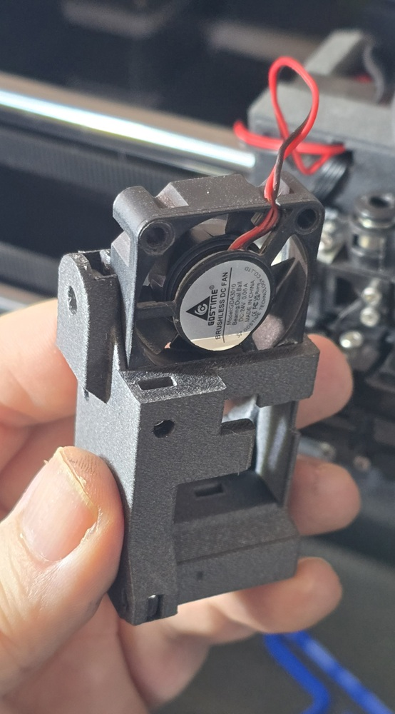
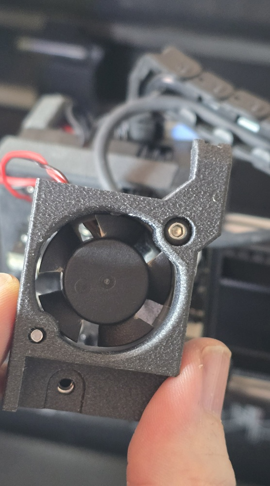
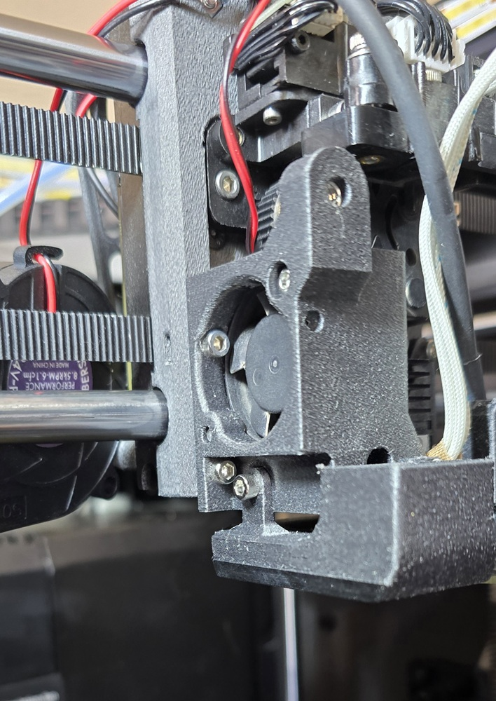

# Front Blower Mod Assembly

These assembly instructions start from a state of disassembly, and moving to a fully assembled state
If you're looking to disassemble your tool-head, just follow these instructions in reverse order

## Initial State

Push the Stepper Motor Back into place against the rear tool head slider

## Affixing the stepper motor

Push the front plate onto the bearings so that they fit into the bearing holding cavities
When everything is aligned, push the plates together carefully, ensuring that the 3 small
alignment pins on the rear of the front plate properly insert into their place holders
on the rear plate.

Using M3 x 20mm SHCS (Socket Head Cap Screw) bolts, gently bolt the two plates together
with the screws placed in the holes circled in red in the following photo.

Do not tighten the screws all the way just yet.  Just tighten them enough such that the
front plate isn't wanting to fall off.

While holding the stepper motor by the gear, wiggle it up until you're able to get the
left mounting screw into the mounting thread on the motor.  This is probably the
trickiest part in the whole assembly sequence.  Once you get the screw in, tighten it,
but not all the way, and do the same for the right-side mounting screw.  Usually once
you get one in, the other is fairly easy to get it aligned.

When both are aligned and in place, then tighten them both firmly.

## Run the front daughterboard and fan cables through their respective slots in the front
tool-head carrier plate, and push the cable securement bracket into place.

## Cable routing and securing

Run both the heatsink and front blower fan cables, and the filament detection cable through
the left side channel, and then Slide on the cable clamp bracket on.

## Attach Part Cooling Fan Duct

## Attach front 5015 Blower and the Fully Assembled View

Gently push the outlet of the 5015 Blower into the inlet opening of the part cooling duct, and use M4x25mm (or 20mm) BHCS
(Button Head Cap Screw) bolts affix the fan to the mounting points.

## Fan Check

Turn on the hotend to 60C, and the part cooling fan to 100% speed.

Verify that the hotend heatsink fan is spinning freely, and that the front blower is working too.

If you place your hand underneath the nozzle you should be able to feel a fairly strong flow of air just below the nozzle.

