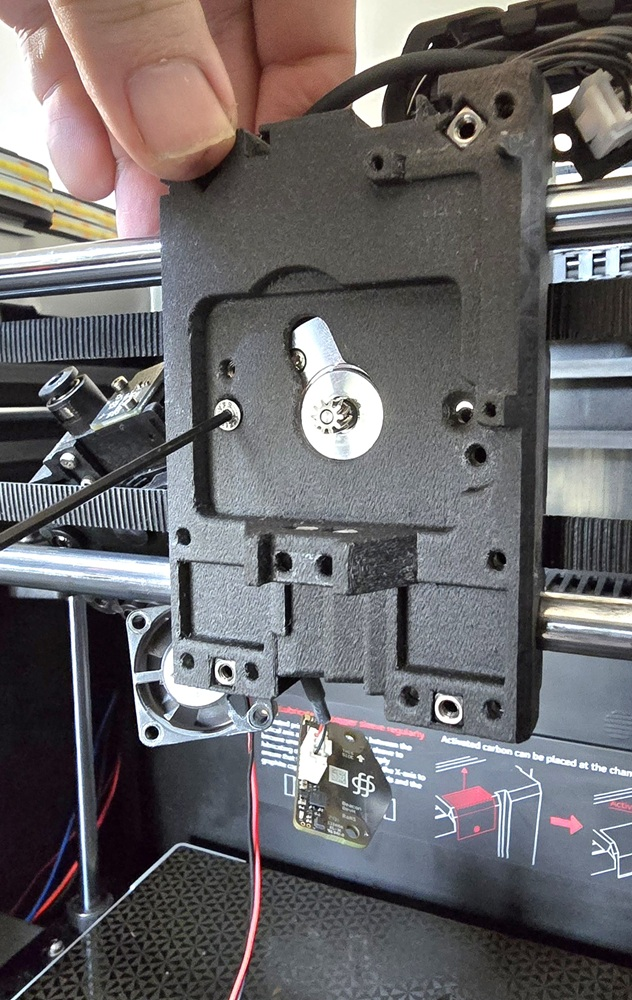
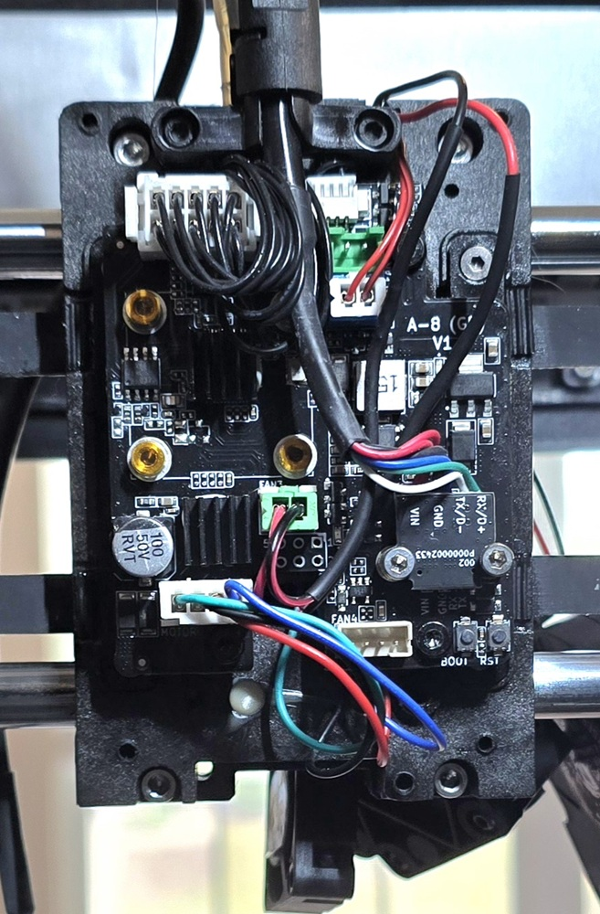
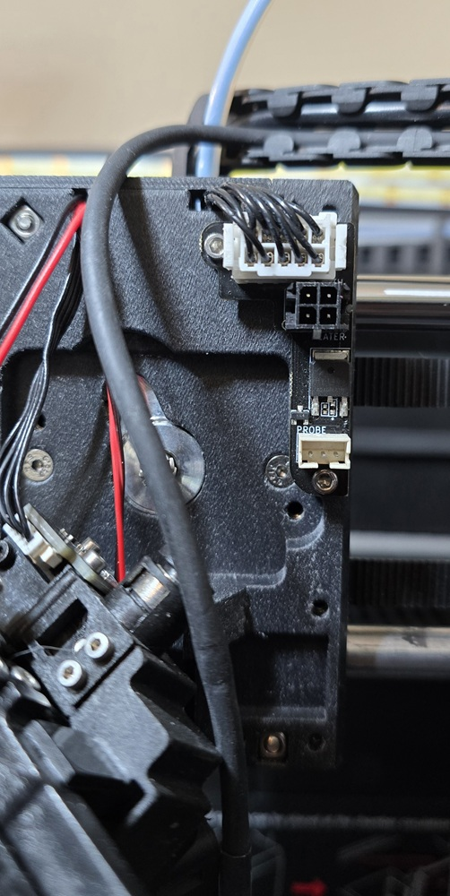
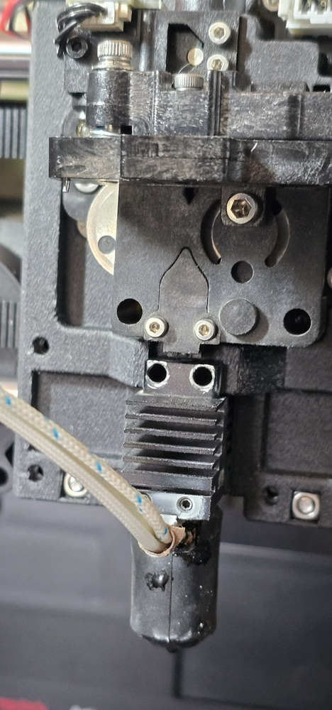
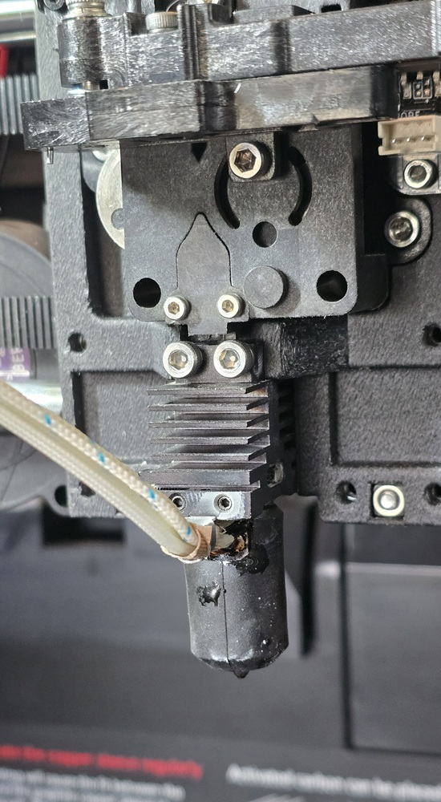
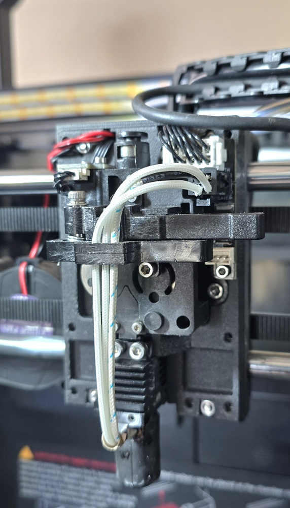
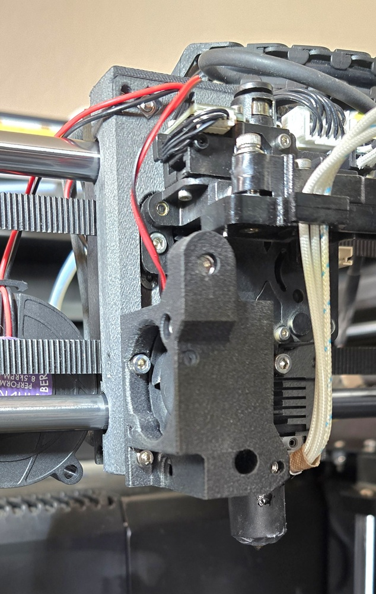
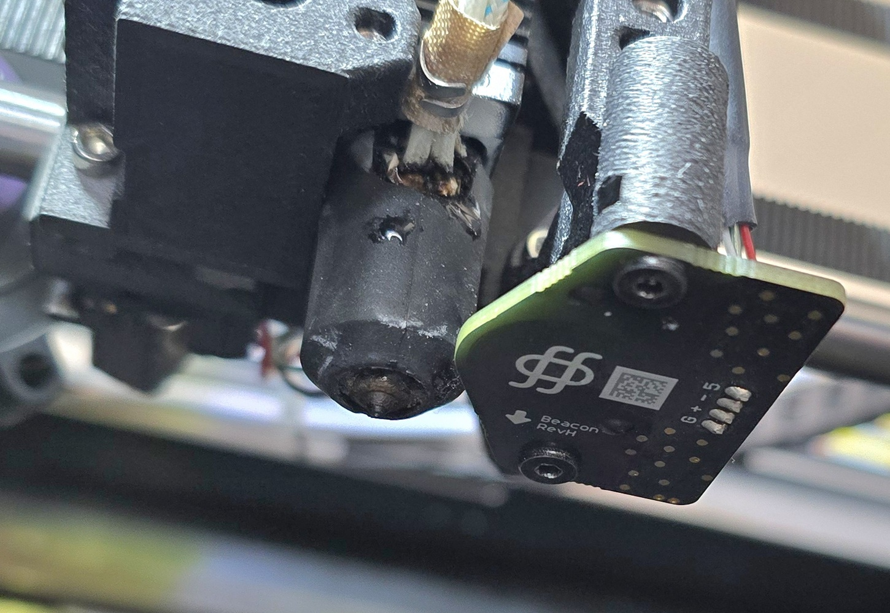
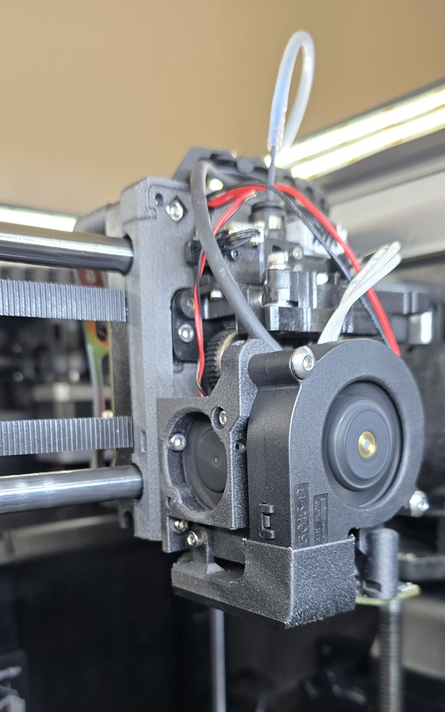

# Front Blower Mod Assembly

These assembly instructions start from a state of disassembly, and moving to a fully assembled state
If you're looking to disassemble your tool-head, just follow these instructions in reverse order

**VERY IMPORTANT:** Ensure that the printer is powered off and unplugged throughout the tool head
assembly procedure.

## Initial State

Push the Stepper Motor Back into place against the rear tool head slider

## Affixing the stepper motor

Push the front plate onto the bearings so that they fit into the bearing holding cavities
When everything is aligned, push the plates together carefully, ensuring that the 3 small
alignment pins on the rear of the front plate properly insert into their place holders
on the rear plate.

P.S. Ignore the front daughter-board in this photo, as it photo-bombed the shot :)

Using M3 x 20mm SHCS (Socket Head Cap Screw) bolts, gently bolt the two plates together
with the screws placed in the holes circled in red in the following photo.

Do not tighten the screws all the way just yet.  Just tighten them enough such that the
front plate isn't wanting to fall off.

While holding the stepper motor by the gear, wiggle it up until you're able to get the
left mounting screw into the mounting thread on the motor.  This is probably the
trickiest part in the whole assembly sequence.  Once you get the screw in, tighten it,
but not all the way, and do the same for the right-side mounting screw.  Usually once
you get one in, the other is fairly easy to get it aligned.

When both are aligned and in place, then tighten them both firmly.

## Cable routing and securing

Run the front daughterboard cables through its slow in the front tool-head carrier plate.

Now run both the heatsink and front blower fan cables, and the filament detection cable through
the left side channel, and then Slide on the cable clamp bracket on.

## Tightening the plates together

Now fully tighten the front and back plates together.  You will already have the top 2
screws in place.  There's two more screws at the bottom.  Push the M3x20mm screws into
place.  Hold the plates together, once again ensuring that the alighment pins are in
place, and that the bearings are sitting in their slots properly, and then tighten all
four screws down firmly.

Afterwards, move the print head side to side by a few centimeters to test that the bearing
are moving freely.

## Affix the front PCB daughterboard

Using the smaller self-tapping screws, attach the daughterboard to the mounting holes and
guide pin to the front of the tool-head as shown.  Make sure not to overly tighten the
self-tapping screws as these can damage or split the screw holes.  Tighten them just enough
that the PCB board doesn't want to wiggle about.

## Affix the rear toolhead cover

Use the 4 self-tapping screws to affix the rear tool-head cover to the back plate.  The cover
shown here is my super-light cover, but the stock rear cover also attaches with the same 4
screws.

## Align the filament detection sensor cabling into the cable guide

On the extruder assembly, the filament detection sensor cables should be placed into the small
cable guide as shown.  It's easiest to push them into place, and then gently pull the cables from
the rear tool-head to tighten them into position.

## Attach the extruder unit with 2 of M3x12mm screws

(See photo)

## Attach the hotend

Push the hotend into place on the front cover.  Make sure that it is seated properly before
tightening the mounting bolts down.  It should not be tilting as you're tighting the bolts.
If it does so, then stop and re-align the hotend until it's properly lined up.

## Route hotend cables and plug into front PCB board

Route the hotend cables through the holding bracket, and plug it into the PCB board
The clip on the plug points downwards.

## Attach the heatsink fan to the fan mount

Slide the heatsink fan into place on the mount, and bolts it into the securing holes.

## Bolt heatsink fan mount to the tool-head carrier plate

(See photo)

## Attach Beacon Probe to bottom of the probe mount

## Attach beacon probe mount to toolhead

## Attach Part Cooling Fan Duct

Secure the fan duct with the two M3 screws as shown

## Attach front 5015 Blower and the Fully Assembled View

Gently push the outlet of the 5015 Blower into the inlet opening of the part cooling duct, and use M4x25mm (or 20mm) BHCS
(Button Head Cap Screw) bolts affix the fan to the mounting points.

## Fan Check

Turn the printer on now.

Now turn on the hotend to 60C, and the part cooling fan to 100% speed.

Verify that the hotend heatsink fan is spinning freely, and that the front blower is working too.

If you place your hand underneath the nozzle you should be able to feel a fairly strong flow of air just below the nozzle.

