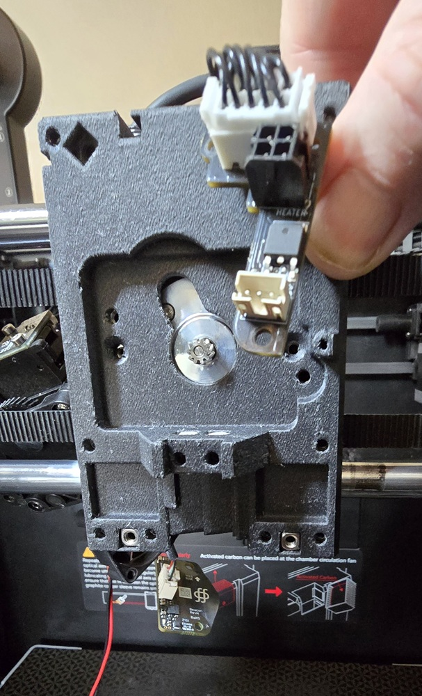
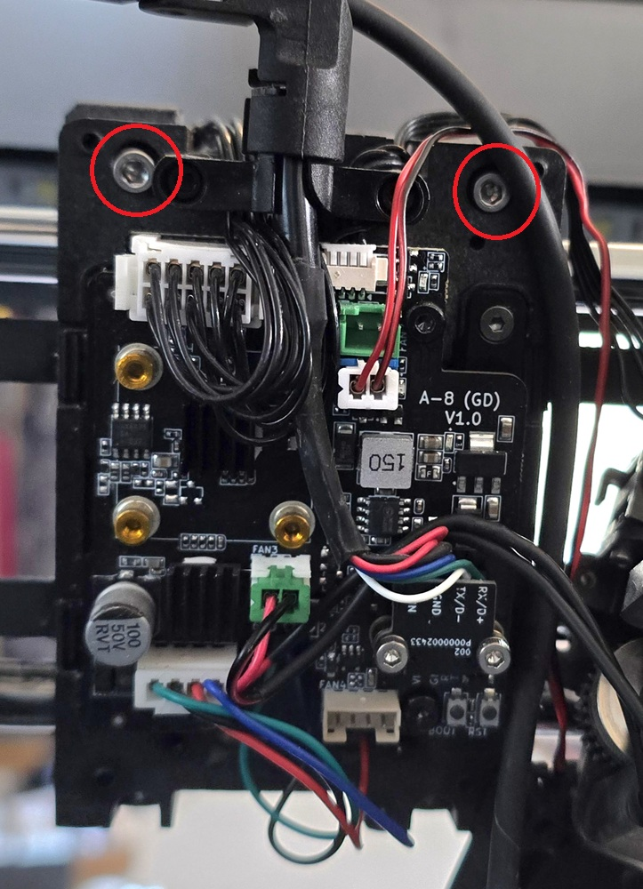
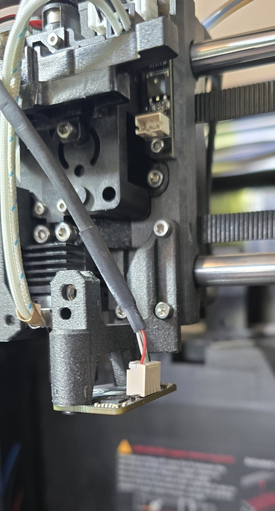
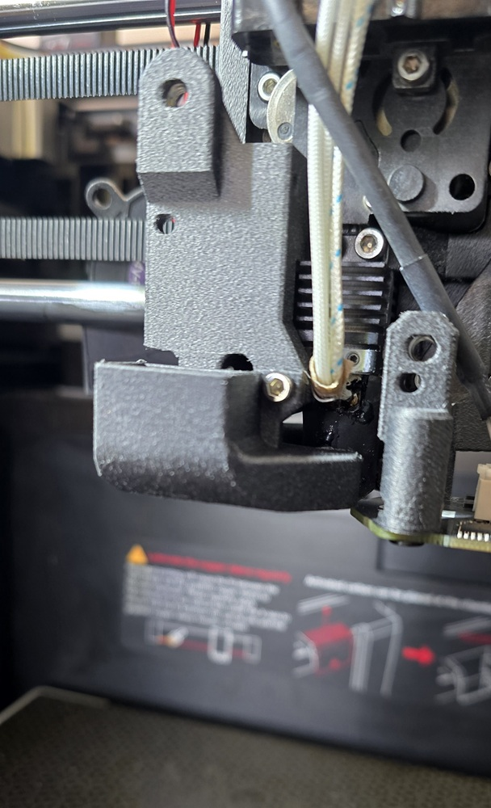
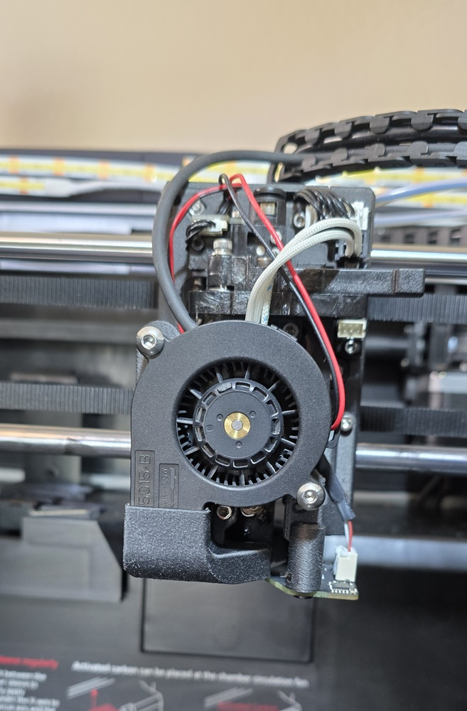

# Front Blower Mod Assembly

These assembly instructions start from a state of disassembly, and moving to a fully assembled state
If you're looking to disassemble your tool-head, just follow these instructions in reverse order

## Initial State

Push the Stepper Motor Back into place against the rear tool head slider

## Attach Part Cooling Fan Duct

## Attach front 5015 Blower and the Fully Assembled View

Gently push the outlet of the 5015 Blower into the inlet opening of the part cooling duct, and use M4x25mm (or 20mm) BHCS
(Button Head Cap Screw) bolts affix the fan to the mounting points.

## Fan Check

Turn on the hotend to 60C, and the part cooling fan to 100% speed.

Verify that the hotend heatsink fan is spinning freely, and that the front blower is working too.

If you place your hand underneath the nozzle you should be able to feel a fairly strong flow of air just below the nozzle.

