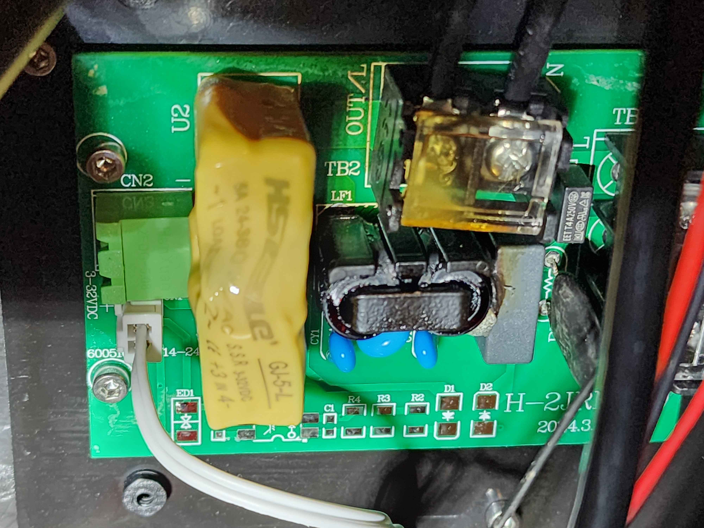

# Qidi Plus 4 SSR Board

The initial units of the Qidi Plus 4 have a problem with the SSR Board that control the chamber heater. It appears under certain conditions the SSR board is not capable of handling the current needed to run the chamber heater on 110 - 120V. 

This results in the SSR board getting very hot and melting the SSR and common mode choke on the board, causing a failure of this component. 

This presents a potential fire hazard and risk of further damage to the printer and surroundings. Because of this, **we advise anyone using the Qidi Plus 4 in North America (or other areas on 110 - 120V  mains)** to take following steps before using the printer:

- Do not use the chamber heater. If you need to print using a heated chamber you can use the bed to heatsoak the chamber. It works, but is slower.

- Upgrade the SSR following our [community guide.](https://github.com/qidi-community/Plus4-Wiki/tree/main/content/heater-ssr-upgrade)

If you are on 220 - 240V you are not affected by this issue.

### Checking SSR for damage

If you wish you check if your SSR has been affected by this problem, Qidi made a [video](https://drive.google.com/drive/folders/180hEn-bLIeLqfGz-xd5-HUZBBD4ypZ1-) showing how to access the SSR. 

An example of a melted SSR looks like this: 

(credit: moisttowelette0891)

If you SSR board looks similar to this, do not use the chamber heater.

### Report from Qidi

Community members have asked Qidi for feedback in regards to the SSR board and specifically the common mode choke getting too hot when running on 110 - 120VAC. Qidi has replied with their own test data, which claims the choke does not exceed 140C on the newest firmware (1.4.3) which runs at 40% duty cycle.

Unfortunately, we have not been able to verify this claim. In fact, community members have found their chokes to run at above 140C when running at 40% duty cycle. This was confirmed on [a live stream](https://www.youtube.com/live/qRWI1maTK6A?si=soHidMfEpfUPszE3&t=13469) from 3D Musketeers, who measured 170C on the choke. 

### Going forward

We believe your printer should be as safe as it possibility can be. At the moment, any printer with the current SSR board installed is not safe. It is clear that Qidi must redesign the SSR board and stop sending out SSR boards that are known to get too hot on 110 - 120VAC. Qidi must warn all customers in the affected regions that have bought a printer. Qidi must offer improved replacement parts for the inadequate SSR board to all customers affected. We hope to see these improvements from Qidi in the coming weeks and months.

