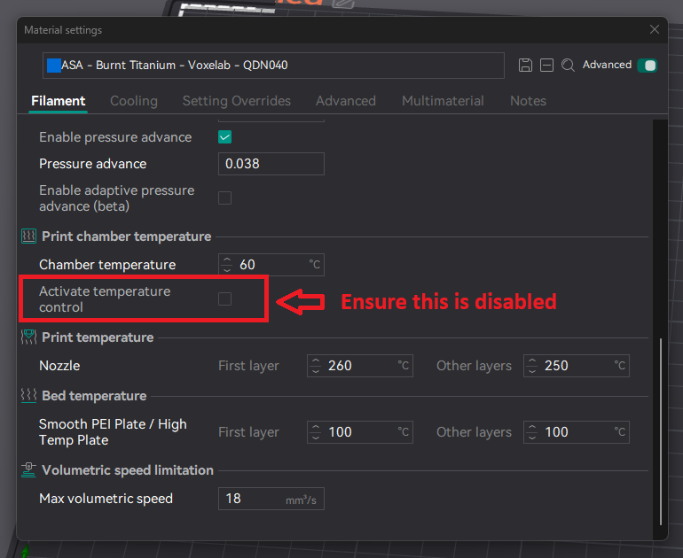

# Tuning Chamber Heater Warmup Times

## Introduction

With the 1.4.3 Firmware Release from Qidi, the stock chamber heater power was dropped from a 70% duty cycle to a 40% duty cycle.

This now made chamber warmup times considerably slower as a result, however we can make some configuration changes to make it not so bad.

Now keep in mind that the primary point of slowness during a print start warmup was actually the print bed, and not the chamber heater warmup,
and we can use this to our advantage to improve the overall situation.


## Test Baseline

### Initial Conditions

- Room Temperature: 23C
- Starting Chamber Temperature: 23C
- Starting Print Bed Temperature: 23C

### Target Conditions

- Chamber: 60C
- Print Bed: 100C

### What are we measuring here?

It makes the most sense to measure the time elapsed between when a print is sent to the printer,
and the time when the bed meshing starts for the print.  This really is the only time that matters here.

## Test 1 - Warmup times at 70% heater power

It was observed that while the chamber temperature would reach the target within 10 minutes,
the print bed would only reach 100C after 16 minutes and 30 seconds before the bed mesh started.


## Test 2 - Warmup times at 40% heater power, stock configuration

It was observed that it took 25 minutes to the time that the bed meshing started


## Test 3 - Warmup times at 40% heater power with tuned `PRINT_START` and `M191` macros

A time of 19m30s was observed to the time that the bed meshing started.


## So, what's the configuration changes you did?

Change the `PRINT_START` macro within `gcode_macro.cfg` to the following in its entirety

```
[gcode_macro PRINT_START]
gcode:
    
    
    

    # AUTOTUNE_SHAPERS                  # Nothing ever makes uses of this though
    # set_zoffset                       # Sample the Z offset (but why even do this now?)
    M141 S{chambertemp}                 # Initiate Chamber Warmup as early as possible
    M140 S{bedtemp}                     # Initiate Print Bed Warmup as early as possible
    M104 S0                             # Make sure hotend is off
    M106 P3 S0                          # Turn off chamber circulation/exhaust fan
    M106 S255                           # Turn on part cooling fan to full speed

    
        M106 P2 S255                    # Set AUX to full to help mix chamber air fully
    
        M106 P2 S0                      # Turn off auxiliary part cooling fan
    

    M400                                # Wait for all prior G-code commands to complete before G28
    G28                                 # Home all axes
    CLEAR_NOZZLE HOTEND={hotendtemp}    # Do nozzle purge and wipe

                # Special chamber handling for fastest thorough warmup times
        M106 P0 S255                    # Ensure part cooling fan is full speed for better air mixing
        M106 P2 S255                    # Ensure AUX is at 100% after CLEAR_NOZZLE was called
        G0 Z5 F600                      # Bring print bed to Z=5mm.  This helps with chamber heating
        G0 X152 Y152 F6000              # Bring print head to middle of print bed
        M191 S{chambertemp}             # Wait for chamber to reach full temperature
        M106 P2 S0                      # Turn off AUX Fan
        M106 P0 S0                      # Turn off part cooling fan
    

    G0 X5 Y5 F6000                      # Move print head to front-left in case of any oozing
    M104 S140                           # Set nozzle to 140 so any remaining filament stuck to nozzle is softened
    M190 S{bedtemp}                     # Wait for print bed to reach target temperature
    G29                                 # Perform Z-offset, and bed meshing measurements
    M104 S0                             # Ensure hotend is fully off to minimise any oozing

               # No chamber temp set. This means we're likely printing PLA/PETG.
        M106 P3 S255                    # Set the chamber circulation fan to 100% to minimise heat creep
    

    G0 Z5 F600                          # Move plate to Z=5mm
    G0 X5 Y5 F6000                      # Move print head to front-left
    M141 S{chambertemp}                 # Ensure chamber is set to on after G29 was called earlier
    M109 S{hotendtemp}                  # Commence hotend warmup
    M204 S10000                         # Set velocity limits
    SET_PRINT_STATS_INFO CURRENT_LAYER=1
    ENABLE_ALL_SENSOR
    save_last_file
```

Additionally, change the `M191` macro, also within `gcode_macro.cfg` to the following in its entirety

```
[gcode_macro M191]
gcode:
    
        
    
        M141 {'%s%s' % (p, params[p])}  
        
            TEMPERATURE_WAIT SENSOR="heater_generic chamber" MINIMUM={([s, 65]|min)-5}
        
    
```

### Discussion on why it works

- Some needless commands were removed
- The print bed is raised up and the auxiliary fan and print head fans are used to transfer as much heat from the print bed to the chamber air as possible
- This is basically using the print bed's heater to its fullest effect to boost the chamber heater in warming the chamber air
- The `M191` chamber wait target is lowered to 5C less than the true target meaning the chamber wait ends a bit sooner
- While Z-offset and bed-meshing takes place, the chamber continues to warm up to the target in the meantime
- The chamber is observed to be fully up to temperature by the time the actual print begins

### Additional Notes

It is **absolutely essential** that the `Activiate Temperature Control` option is disabled in the filament settings in your slicer.
If this feature is active, then the slicer will instruct the printer to attempt to warm the chamber without the assistance of the print bed heater,
and there are reports that this can take up to 1 hour for the chamber to reach 60C.


